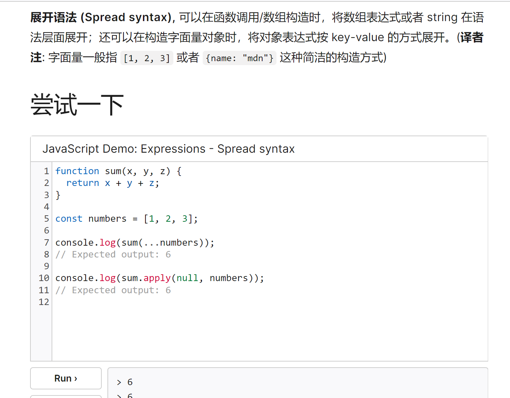
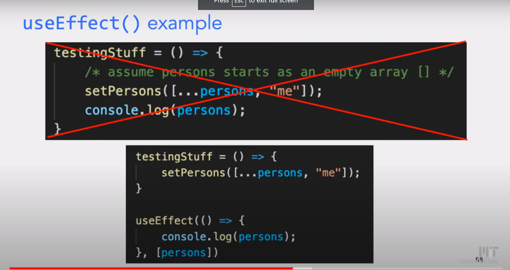
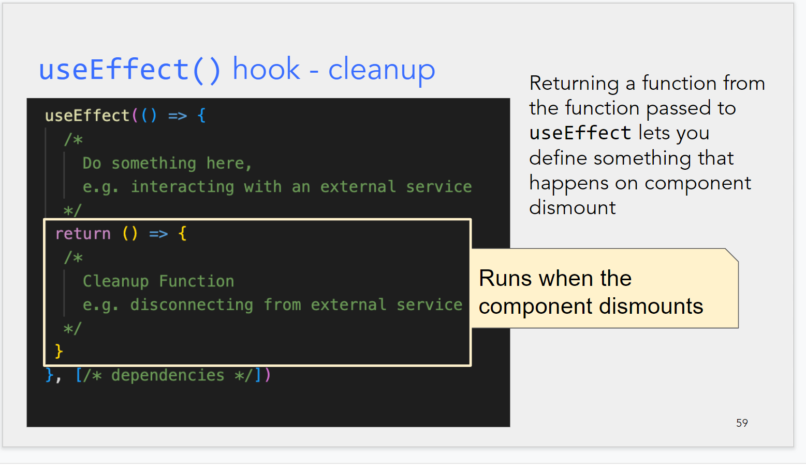
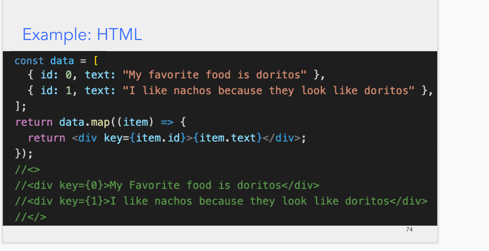

$\text{flex}$[https://www.ruanyifeng.com/blog/2015/07/flex-grammar.html]

---

(html 的 header 文件)[https://developer.mozilla.org/zh-CN/docs/Learn/HTML/Introduction_to_HTML/The_head_metadata_in_HTML]

---

---

$\text{React(use state)}$

- state 是 React 中 component 里唯一一个被 memory 的部分,每一次 state 的值被重新 set,就会触发(trigger) 整个 component 被重新渲染(render),可以理解为从头开始执行
- setstate 是 async 的

$\text{useeffect hook} $

强制同步,避免 setstate 的异步性带来一些期望以外的结果

$\text{example}$:

当一个 component dismount 的时候(可以理解为停止渲染?或者说结束一个生命周期?)可以设置一个 **cleanup**
如下图

(注意这个 return 是在 useEffect 的括号内的)

---

$\text{Using map to translate data to HTML}$

$\text{eg:}$

---
