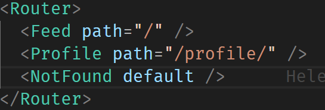
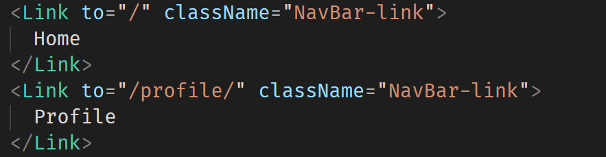
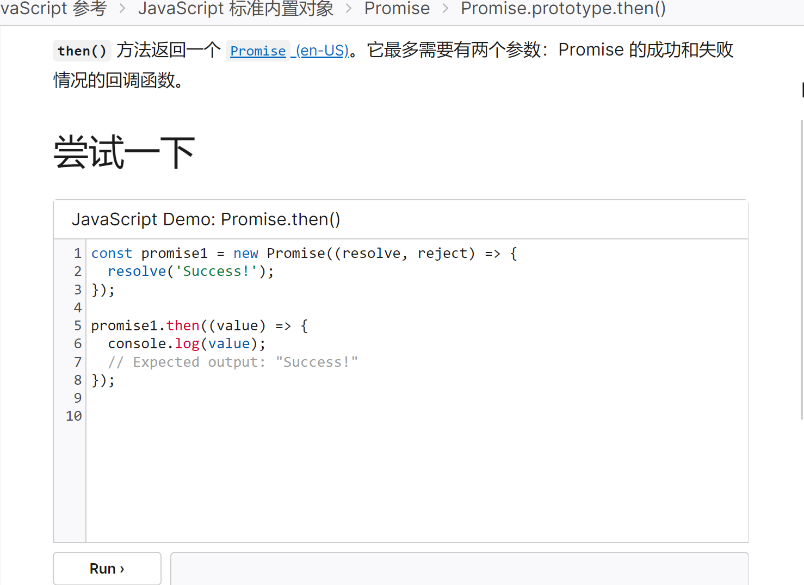
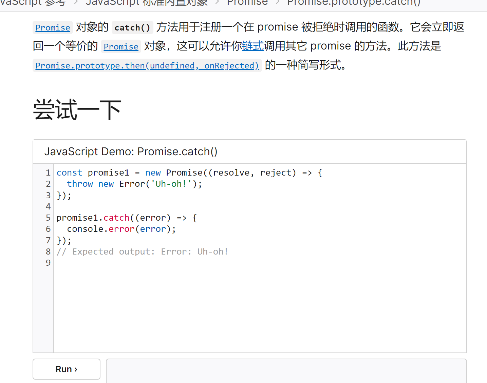

$\text{Router}:$

- 个人感觉就是给 $\text{component}$ 分配网址?(奇怪的理解
  
- (在父亲的地方分配)
- 
- 用 $\text{Link}$ 对象,或者朴素的 $\text{link - href}$ 都可以

---

$\text{Promise:}$

- 一个对象,不一定马上执行(要注意 JS 的异步性($\text{async}$))
- 分为 fulfilled 和 reject 态, fulfilled 代表就绪,可以执行,$\text{then}$ 函数接受一个 $\text{callback}$ (函数),并以 promise 的对象为参数
  

- 失败(reject)的时候会马上调用一个 $\text{catch}$ 函数
  

---

$\text{fetch:}$

- 一个 $\text{API}$,可以用来发送 $\text{get},\text{post}$ 请求,返回一个 $\text{Response}$ 的 $\text{Promise}$
- 需要另外实现一个函数将 $\text{Promise}$ 转换成 $\text{json}$ 对象

---
