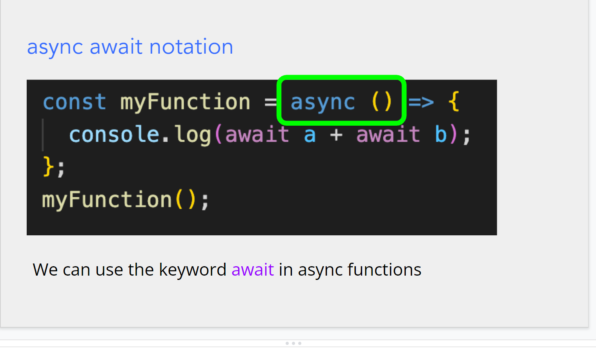
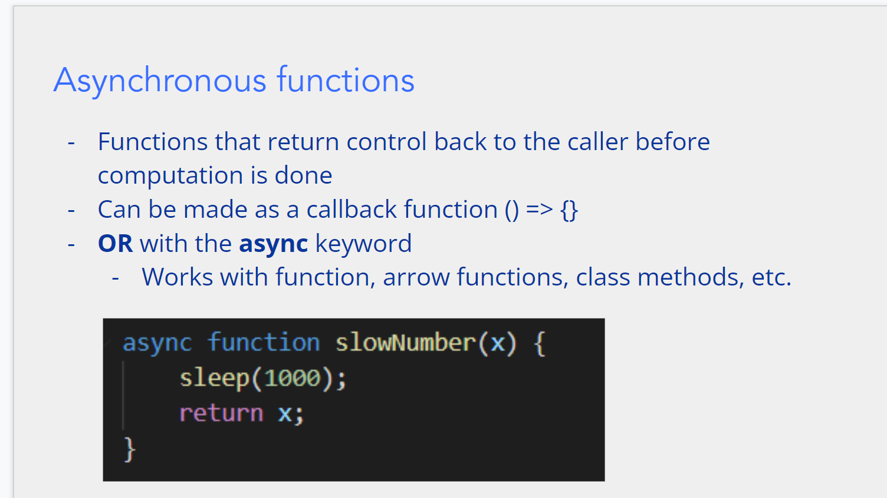
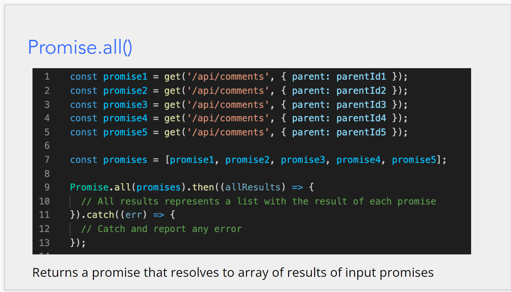
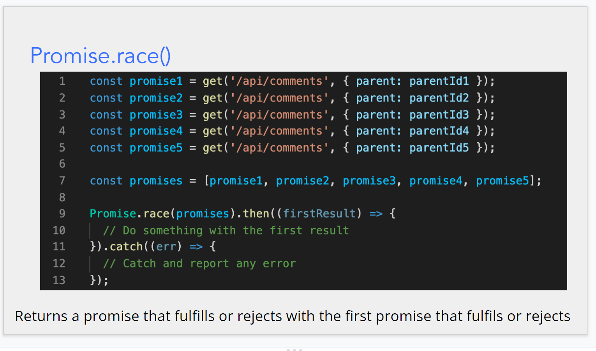
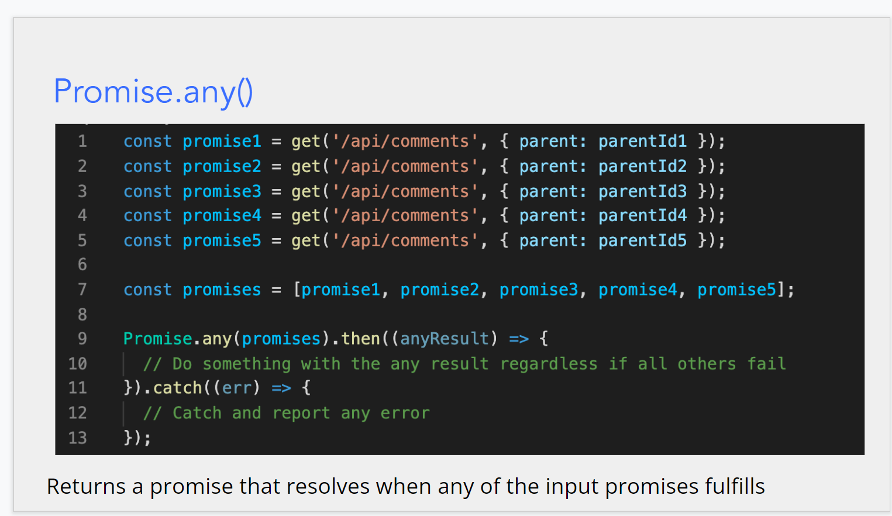

$\text{async and await}$

- why do we need async
  
- for a async promise,using key word **await** can waits for the promise resolve
- only async function can use **await**
  
  

---

$\text{some function of promise:}$

---
