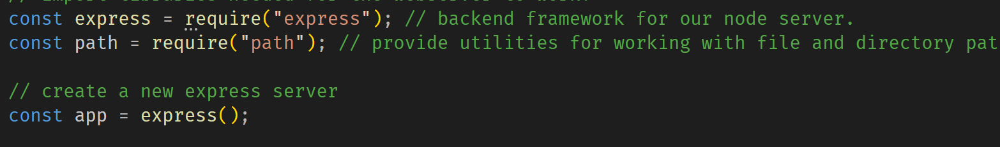
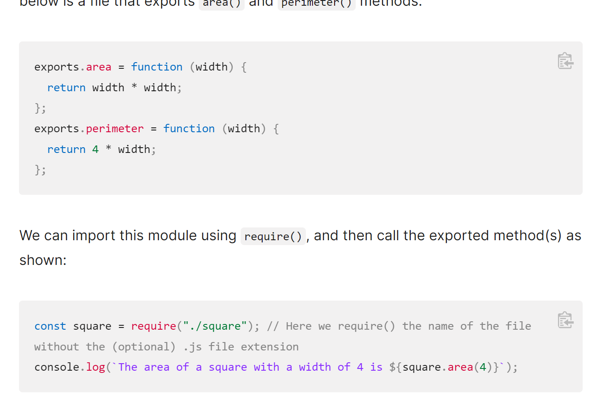
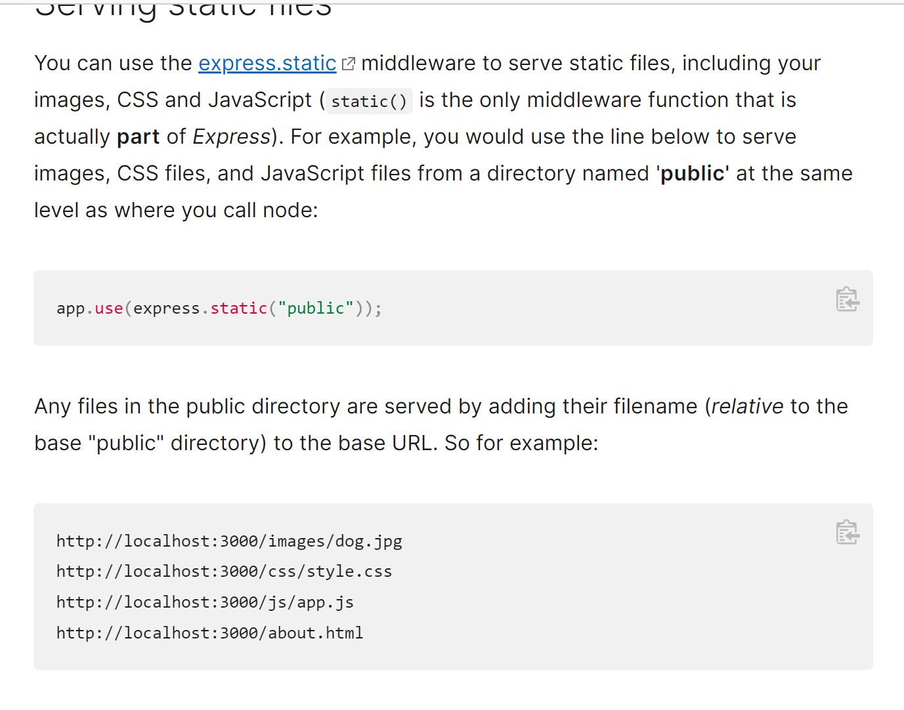
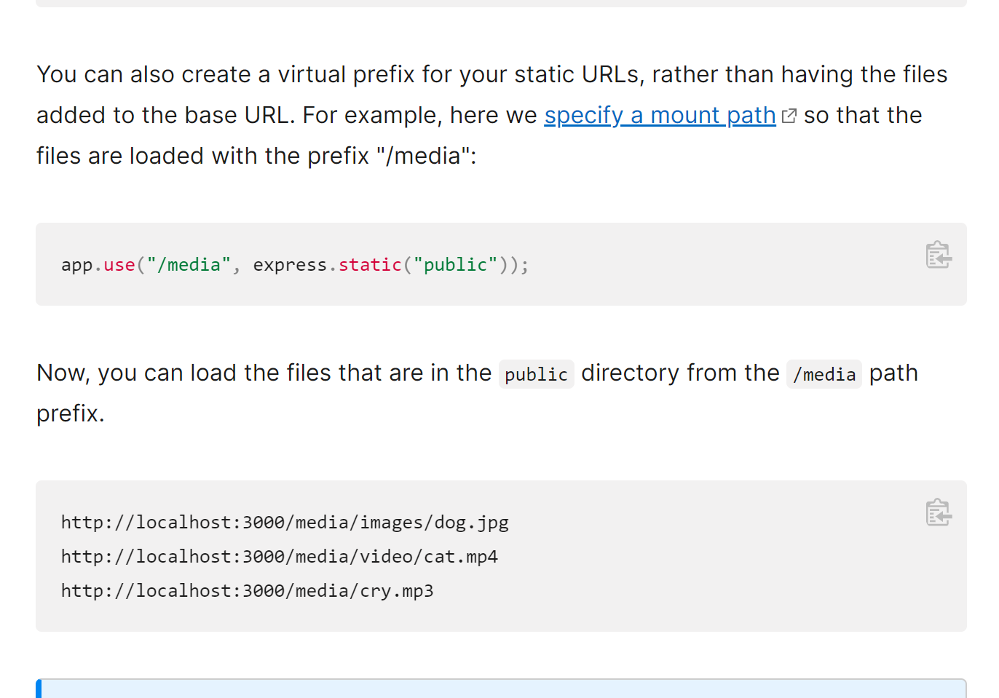

### $\text{Server.js}$

---

$\text{require method}$

- tutorial 链接 (https://developer.mozilla.org/en-US/docs/Learn/Server-side/Express_Nodejs/Introduction)
- 相当于一个 $\text{import}$
- 可以直接 $\text{import}$ 一些模板
- 如

```
const express = require("express")
```

- 返回的变量 $\text{express}$ 是一个 带有很多模板功能的 application

- 用法如下



- 也可以自己写一些 module,放在其他文件,然后 export 出来



---

$\text{static:}$

- 可以用来静态加载一些本地的文件
  
- 并且可以自己加一个前缀,如:
  

---
