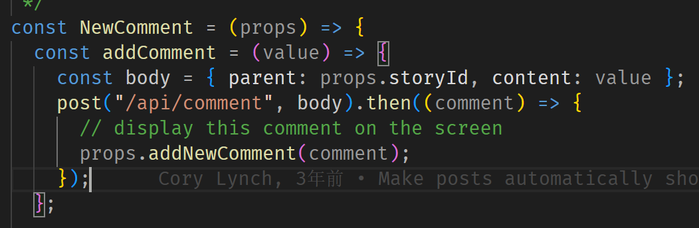

$\text{后端的get,post method}$

- 以我个人的理解,后端的 $\text{get},\text{post method}$ 描述的是对于前端的 $\text{get,post}$ 请求所作出的反应

- 如上图,当前端进行 $\text{/api/story}$ 的 $\text{post}$ 的请求的时候,我们将新增一个 story 的 Object,将其添加进我们的 data(但注意到实际上不能永久存到本地,所以需要数据库) 里面,并通过 $\text{send}$ 的方法,发送给前端

前端 $\text{then}$ 里面的 $\text{comment}$ 变量正是后端所发送的

- 还是上图,当前端发送 $\text{/api/comment}$ 的 $\text{get}$ 请求的时候,我们就会过滤出特定的 $\text{comment}$,并返回给前端

---
