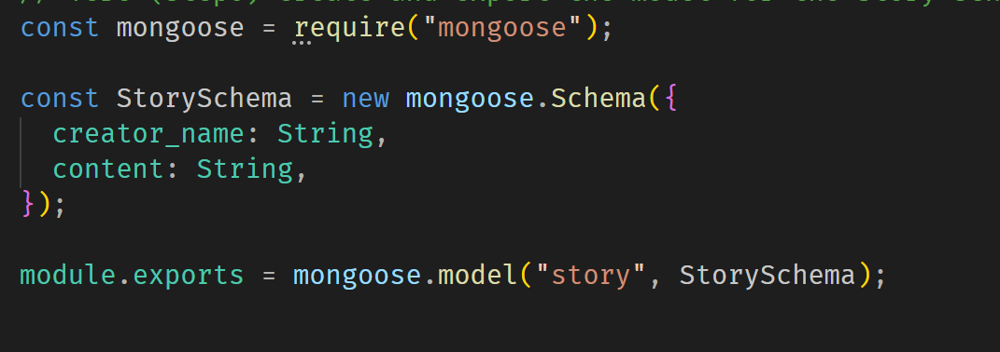
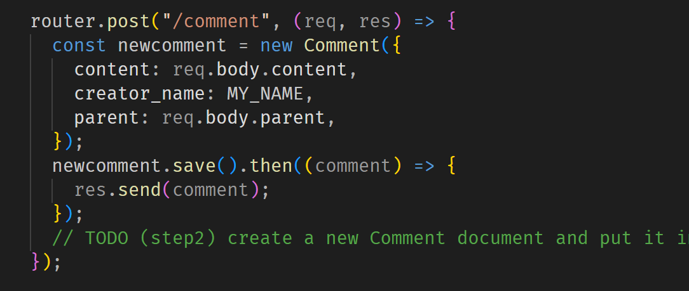
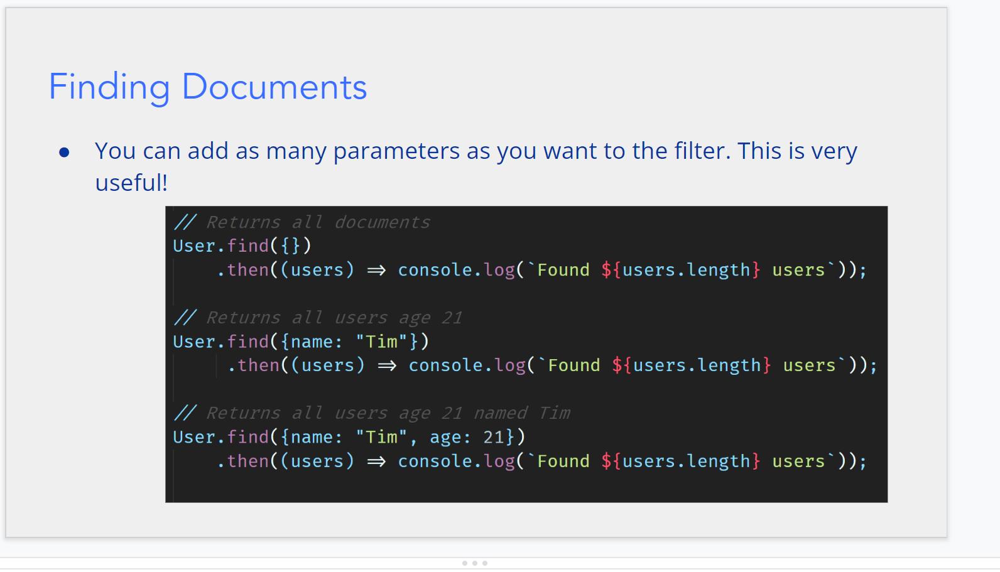
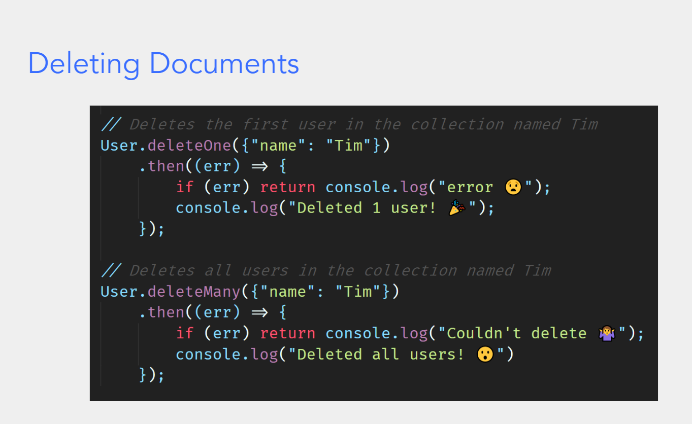

### $\text{database}$

---

- 如何连接 $\text{mongodb}$,代码见 (./lab6/server)

---

- 数据库的结构
- 首先通过 $Schema$(中文翻译:样式) 定义一个模板类
  如:
  
- 要声明类型,主要类型有 $String$,$Number$,$\text{Boolen}$ 等
- 声明一整个模板的数据结构如:

```
DataStructure = mongoose.model("story",StorySchema)
```

- 接下来可以考虑往数据结构里新增数据(通过 new 关键字,记得 save):
  
- 接下来是几个常见的操作:
- 1.通过关键字查找
  
- 2.新增数据,如上文
- 3.删除数据
  

---
