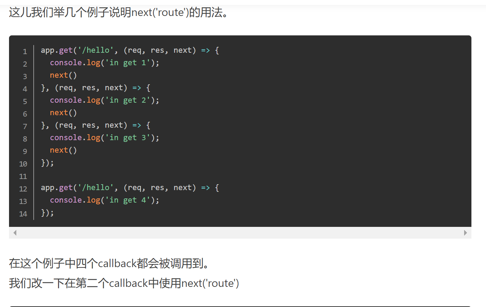
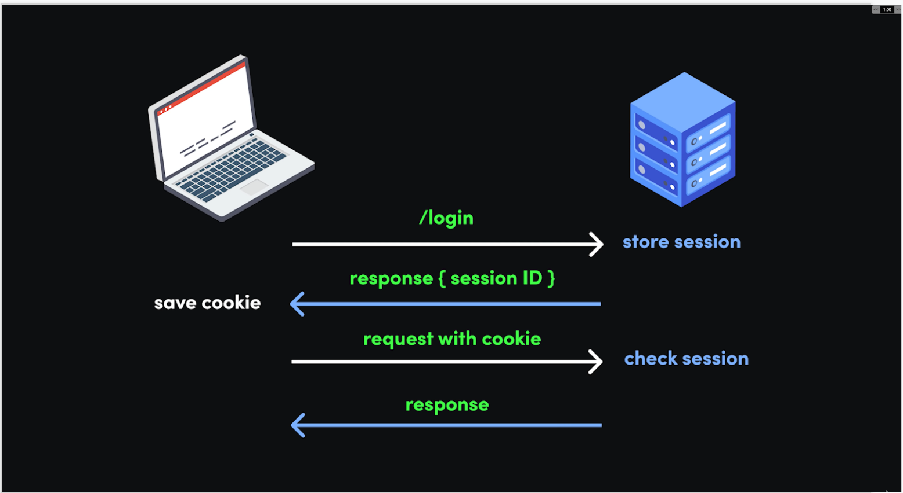
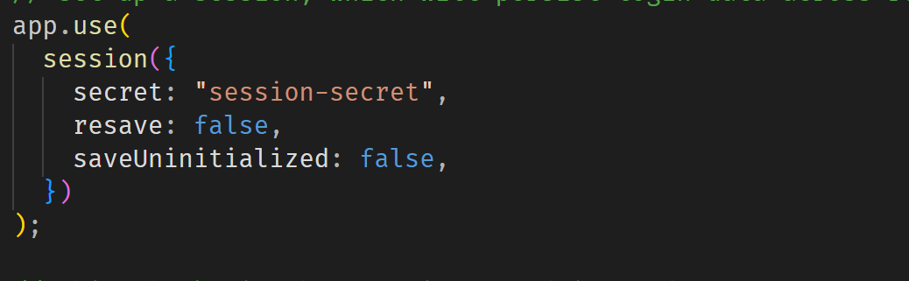
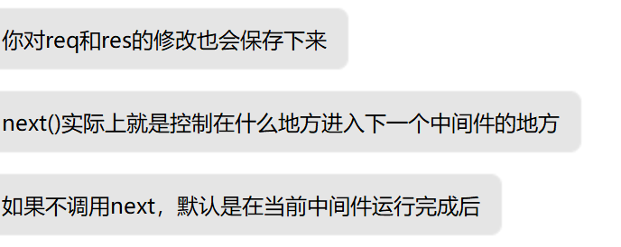

$\text{next method:}$

- $\text{next}$ 表示跳转到下一个 middleware 或者 route
- 举个例子,就像下图

---

$\text{session 和 token}$

- 因为 $\text{http}$ 是无状态的,所以我们需要在某个域名下的所有子网站共享状态
- 这里先只介绍 $\text{session}$,因为 $\text{token}$ 我还没搞懂

---

$\text{use 和 middleware}$ 的进一步理解

