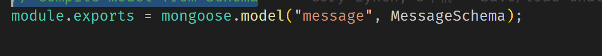
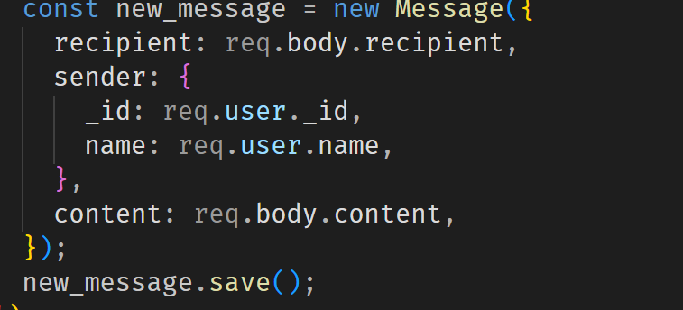
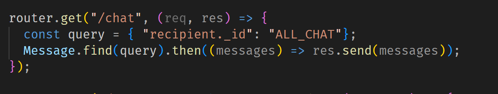
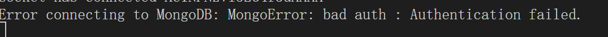

一些细节补充:

- moogodb 会自动把类名转化为大写,如:
  此处 定义的类名 "message" 是小写
  
  但实际使用的时候,需要的类名 仍然是大写
  

---

- moogodb 在使用 find 的时候 query 里的关键字名可以加引号(事实上有时不得不加引号),如:

---

需要更新状态,记得用 $\text{useState,useEffect}$

---

在设计程序之前,一定要先画好前端的 $\text{component}$ 树,以及每一部分是在干什么, 每个数据类型是什么,否则难以维护.

---

database 和 auth 是有冲突的

不懂 auth 自闭

---
