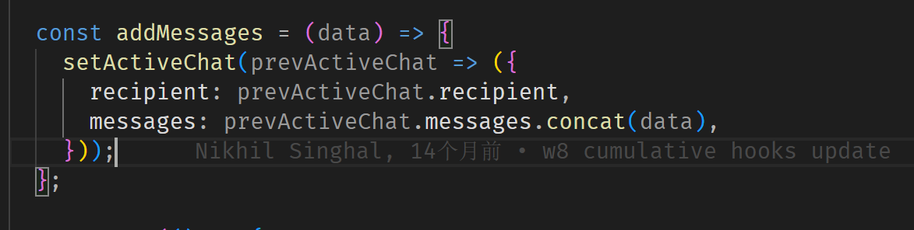
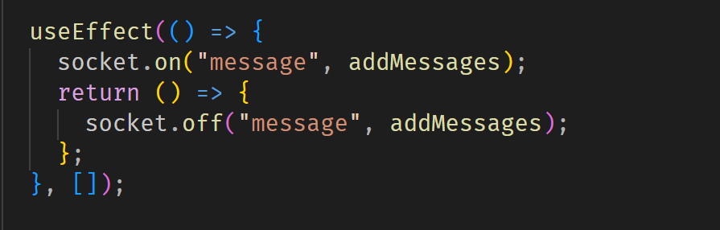

## $\text{Socket}$

Q:为什么我们需要 $\text{socket}$

A:因为 $\text{http}$ 是只有 $\text{request}$ 的时候 server 才会 返回消息给 client,但有时候我们希望能够实时通信
这个时候就需要 socket

basic usage is like:

---

- setState 的一个参数使用()
- 

useEffect 返回时消除副作用

- 

---

socket.on("event",callback)

相当于(在当前生命周期下永久性地)开了一个端口,只要每次 event 被另一端(服务器端)调用了,都会执行 callback 函数

---

让 server 知道每个 client 的 socket,以便于可以准确的实行 direct message(翻译:私信?)

---
