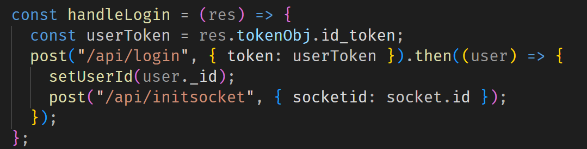
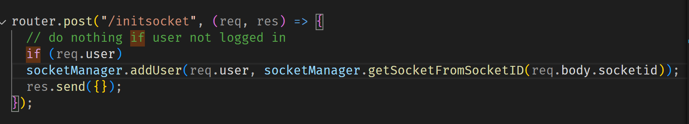
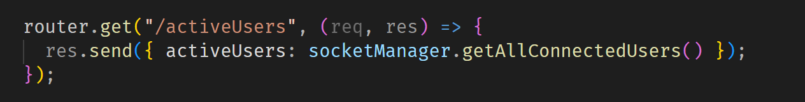
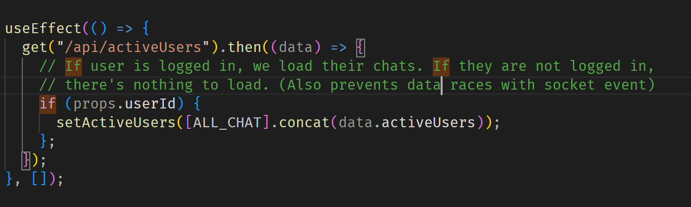
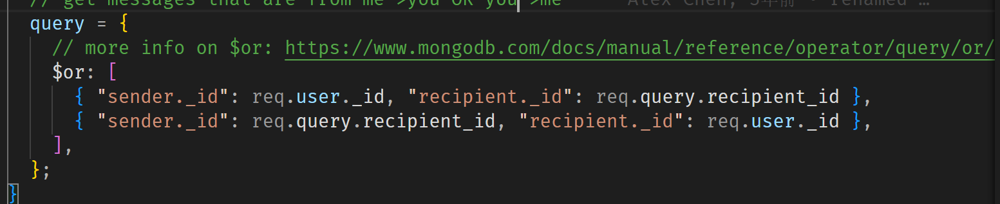
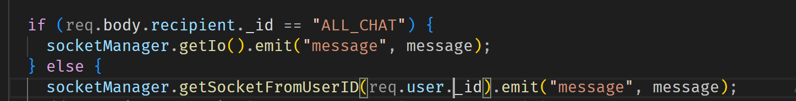
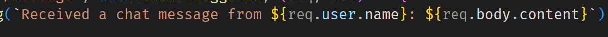
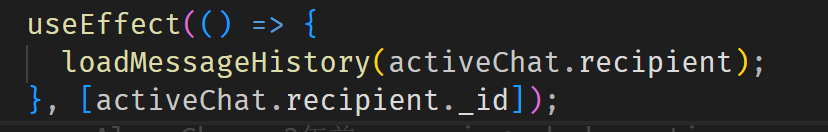
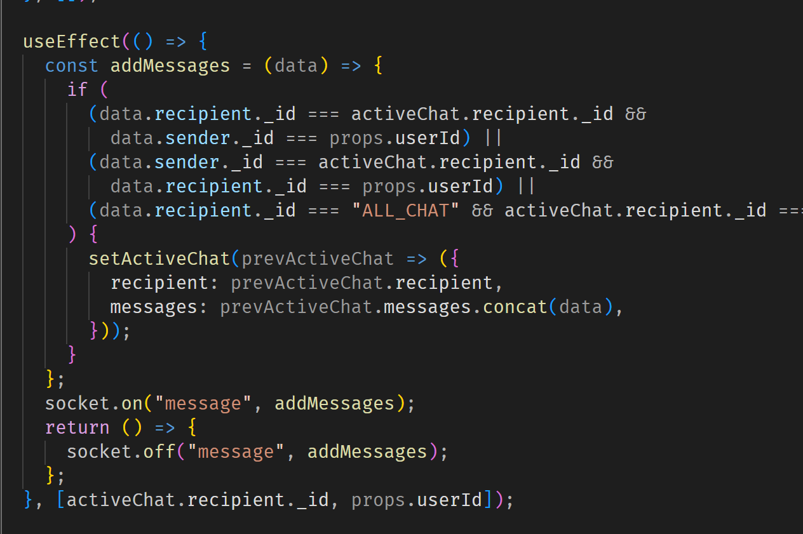

第一步,每个用户在登陆的时候,把自己的 socketid 交给 server

在前端:

在后端:


---

得到所有连接着的用户的方法:


(这个好像不是内置函数)


---

有关 $\text{query}$ 如何查询 A or B


---

getsocket from user_id



---

不应该在一个 callback 函数里调用 socket! 网站只对 useEffect 有记忆!

---

设计思路:先写前端的 component,思考清楚 data 和 callback 函数的传递(在最开始的时候),思考清楚 要定义什么状态 (useState),记住网页只对 useState 有记忆
根据前端的功能需求设计后端
socket 要放在 useEffect 里面!
要想清楚在什么情况下要更新 useEffect,即[] 里放的参数

debug:
前端的 console 在网页看,
后端的 console 在本机服务器看

---

format 的写法



注意是

```
` `
```

不是引号

---

useState 什么时候使用,useState 提供一个半永久的状态(只要不刷新网页就不会改变),所以我们可以考虑把一方面把数据存在数据库里,每次刷新网页的时候从数据库里获取数据,一方面把数据暂时性的存在 State 里,可以减少时间,同时起到一个 render 的效果(通过切换 State 来切换前端显示的东西)

如:每次切换用户(通过一个 prop down 将切换的功能下传到子 component)的时候



首先加载历史数据,

接着用一个 socket 实现在前端实时更新,并在后端存进数据库里



---
