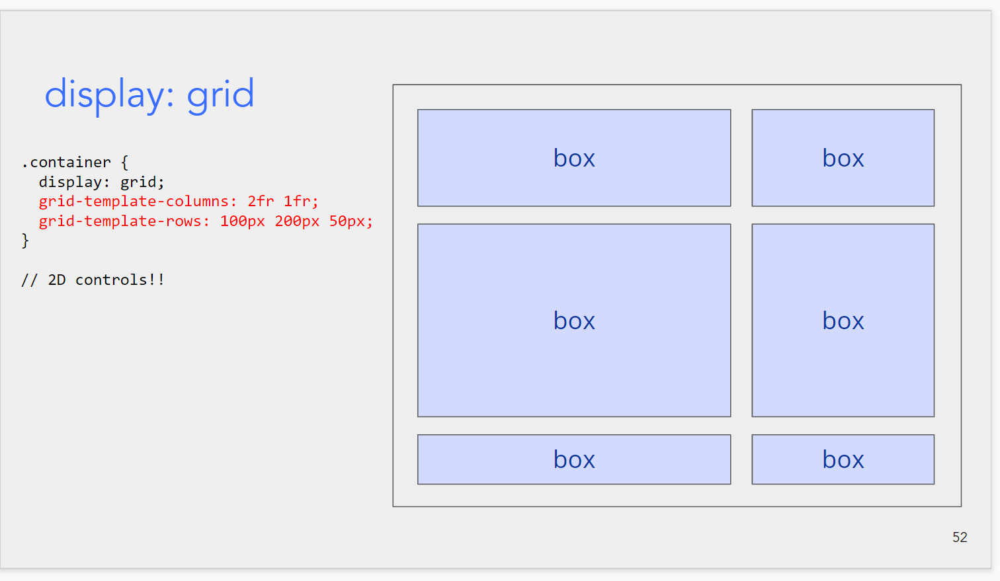
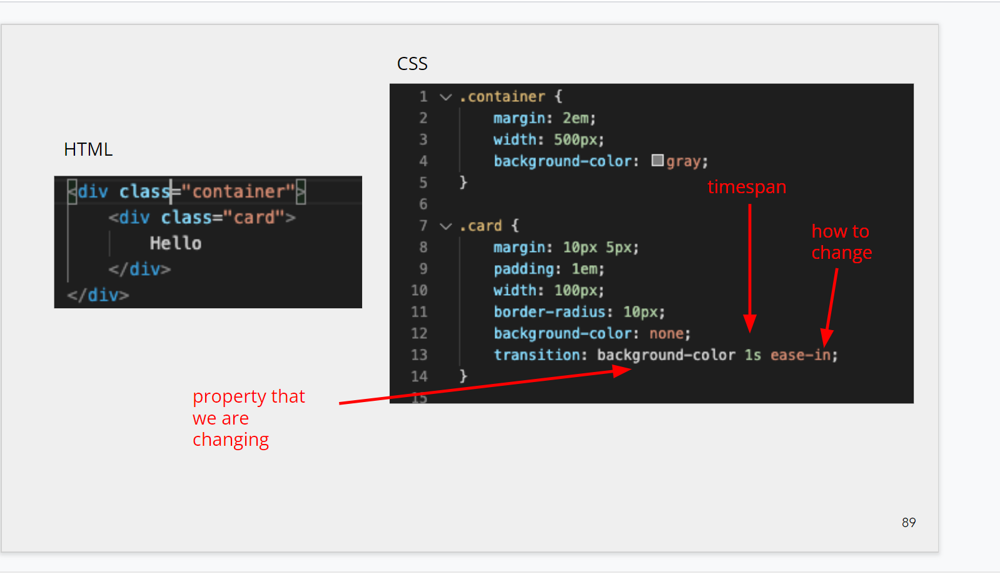

## $\text{Advanced CSS}$

---

$\text{display:grid}$

control 2D

---

$\text{position:}$

- static
- relative
  相对另一个 box 的位置
- absolute
  绝对位置(不会随着屏幕的移动而改变)
- fixed
  固定在屏幕的某个位置,如固定在屏幕的左下角

---

$\text{calc and vw}$

---

$\text{CSS combinators}$

- 根据一定的规则结合若干个 selector

---

$\text{pseudo}$

- 不止根据元素本身,还根据元素的一些状态(如鼠标的位置) 来设置 渲染效果
- [https://developer.mozilla.org/en-US/docs/Web/CSS/Pseudo-classes]

---

$\text{transion and animation}$

- transition as a key word determine how changes in properties show up in your screen!

---

$\text{How to Design good}$

---
