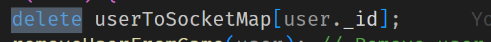

$\text{Object.values()}$

把对象变成数组:

---

一些零散的知识点:

$\text{useRef}$
$\text{indexOf}$
$\text{splice}$

$\text{foreach:}$

- 相当于循环,遍历数组中的每一个元素

---

$\text{EventTarget.addEventListening(type,function)}$

---

javascript 是值传递,但是如果传递给对象,对象访问的则是引用的拷贝

---

对象转为数组, key 可以用来作为下标
(相当于 map),删除特定元素:

---

socket 不一定只有 server 传给 client,也可以 client 传给 server

---

一些设计思路:

1. 读取键盘输入
   使用 Event,开一个 EventListener
2. 每隔一段时间就 update 游戏状态
   setInterval
   更新状态的同时,开一个 socket 传递信息,更新前端应该更新的 render(渲染)
3. 不需要实时的用 API 代替 socket
4. 记得由于 token 的存在, req.user 的值永远是真的,可以不用 req.body.userId
5.
